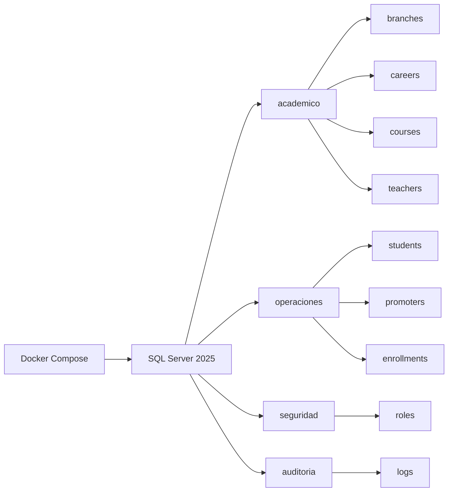

# MatriculaCloud360Enterprise


## 1. 📌 Descripción general del proyecto

MatriculaCloud360Enterprise es un sistema de gestión y matriculación académica de nivel enterprise, diseñado para ejecutarse sobre SQL Server 2025 y desplegarse de forma completamente contenedorizada mediante Docker y Docker Compose.

El repositorio organiza la solución en scripts SQL de creación y carga de datos, con una arquitectura basada en esquemas por contexto de negocio. Esto permite separar claramente las responsabilidades del dominio, facilitar el mantenimiento y asegurar una mejor trazabilidad entre entidades, relaciones y procesos de matrícula.

El modelo incorpora tablas con llaves primarias y foráneas, control de borrado lógico mediante el campo deleted_at y una transacción para el registro de matrículas, garantizando consistencia en operaciones críticas.



## 2. 🏗️ Arquitectura de la base de datos

La base de datos principal se crea con el nombre MatriculaCloud360 y se organiza en los siguientes esquemas:

### academico

Contiene la información académica central del negocio:

- branches: sedes o campus institucionales.
- careers: carreras académicas ofrecidas por cada sede.
- courses: cursos asociados a una sede.
- teachers: docentes asignados a una sede.

### operaciones

Abarca los procesos transaccionales y operativos:

- students: estudiantes registrados en el sistema.
- promoters: promotores comerciales o de captación.
- enrollments: matrículas académicas, vinculadas al estudiante, la carrera, la sede y el promotor.

La inserción de matrículas se maneja mediante una transacción, lo que permite confirmar todas las operaciones o revertirlas por completo ante cualquier error.

### seguridad

Centraliza los elementos de control de acceso:

- roles: catálogo de roles del sistema, como Administrador, Coordinador Académico y Promotor.

### auditoria

Registra trazabilidad de eventos importantes:

- logs: bitácora de operaciones realizadas sobre tablas críticas, incluyendo el usuario del sistema, la fecha y el identificador del registro afectado.

### Criterios de diseño

- Llaves primarias y foráneas para asegurar integridad referencial.
- Borrado lógico con deleted_at en las tablas operativas y académicas principales.
- Separación por contexto de negocio para mantener una arquitectura clara y escalable.
- Registro de auditoría para soportar seguimiento de operaciones.

## 3. 📁 Estructura del repositorio

```text
MatriculaCloud360Enterprise/
├── datasets/
├── docker/
├── sqlserver/
│   ├── ddl/
│   └── dml/
└── README.md
```

### datasets/

Directorio destinado a material de apoyo, documentación complementaria o recursos de datos asociados al proyecto.

### docker/

Contiene la configuración del entorno contenedorizado:

- docker-compose.yml: define el servicio de SQL Server 2025, el puerto publicado y el volumen persistente.
- init/: scripts auxiliares para inicialización del entorno.
- volumes/: carpeta preparada para la persistencia de datos del contenedor.

### sqlserver/

Incluye los scripts SQL que construyen y alimentan la base de datos:

- ddl/: scripts de definición de la base de datos, esquemas, tablas y llaves foráneas.
- dml/: scripts de inserción de datos iniciales y carga transaccional de matrículas.

## 4. ⚙️ Prerrequisitos

Antes de ejecutar el proyecto, asegúrate de contar con lo siguiente:

- Docker instalado y en ejecución.
- Docker Compose disponible como parte de Docker Desktop o como comando independiente.
- Azure Data Studio o SQL Server Management Studio para conectarte a la instancia y ejecutar consultas.

## 5. 🚀 Instalación y ejecución rápida

### Paso 1. Clonar o abrir el repositorio

Ubica una terminal en la raíz del proyecto MatriculaCloud360Enterprise.

### Paso 2. Definir la contraseña de SQL Server

El archivo docker/docker-compose.yml utiliza la variable de entorno SA_PASSWORD. La forma más simple es usar el archivo docker/.env que ya trae el valor de ejemplo del entorno local.

Si prefieres definirla manualmente en PowerShell:

```powershell
$env:SA_PASSWORD = "Admin2026"
```

### Paso 3. Levantar el contenedor

Desde la carpeta docker/, ejecuta:

```bash
docker-compose up
```

Si prefieres hacerlo desde la raíz del repositorio, ejecuta:

```bash
docker compose --env-file docker/.env -f docker/docker-compose.yml up -d
```

Si usas la sintaxis clásica desde la raíz del repositorio:

```bash
docker-compose --env-file docker/.env -f docker/docker-compose.yml up -d
```

### Paso 4. Verificar que el servicio esté activo

```bash
docker ps
```

Debes ver un contenedor llamado sqlserver_matricula publicando el puerto 1433.

Si necesitas reiniciar la base desde cero, detén el entorno con:

```bash
docker compose --env-file docker/.env -f docker/docker-compose.yml down -v
```

### Paso 5. Conectarse a la base de datos

Usa Azure Data Studio o SSMS con los siguientes datos:

- Servidor: localhost,1433
- Tipo de autenticación: SQL Login
- Usuario: sa
- Contraseña: la misma valor definida en SA_PASSWORD

### Paso 6. Inicialización automática

Al levantarse el contenedor, Docker Compose ejecuta automáticamente la secuencia de inicialización:

1. Creación de la base de datos MatriculaCloud360.
2. Creación de los esquemas academico, operaciones, seguridad y auditoria.
3. Creación de las tablas y llaves foráneas.
4. Carga de datos iniciales y matrículas de ejemplo.

Si deseas ejecutar los scripts de forma manual para pruebas o mantenimiento, puedes usar este orden desde tu cliente SQL:

```text
sqlserver/ddl/01_database.sql
sqlserver/ddl/02_schemas.sql
sqlserver/ddl/03_tables.sql
sqlserver/dml/01_seed_data.sql
```

Al finalizar la inicialización automática, la base de datos MatriculaCloud360 quedará lista con su estructura y datos semilla.

## 6. 👤 Autor / Desarrollador

Luis Mencia Chipa

---

Proyecto académico orientado a la implementación de una plataforma enterprise de gestión y matriculación sobre SQL Server 2025 con despliegue en contenedores.

