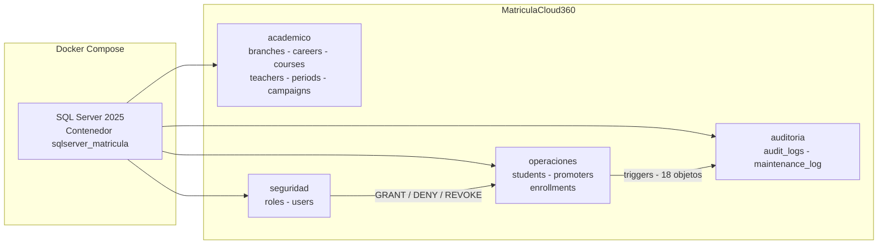
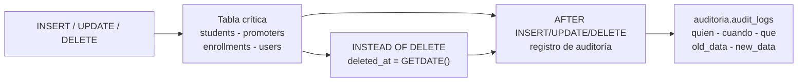
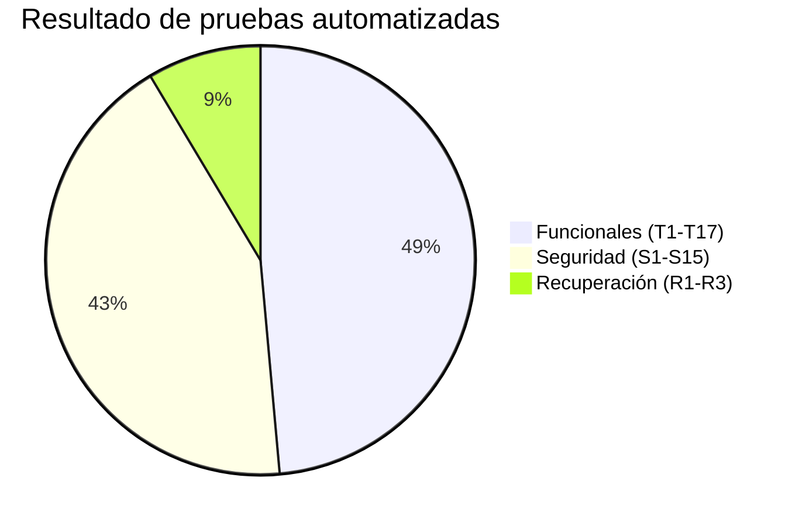

# MatriculaCloud360Enterprise

> Plataforma de datos empresarial para la gestión integral del proceso de matrícula académica.
> SQL Server 2025 Developer + Docker Compose.

[](https://www.microsoft.com/sql-server)
[](https://www.docker.com)
[](.) 
[](.) 
[](.) 
[](.) 

---

## Índice

| Sección | | Sección |
|---|---|---|
| [1. Descripción general](#1-descripción-general) | | [6. Inicialización automática](#6-inicialización-automática) |
| [2. Objetivos del proyecto](#2-objetivos-del-proyecto) | | [7. Cómo ejecutar la demostración completa](#7-cómo-ejecutar-la-demostración-completa) |
| [3. Arquitectura de la base de datos](#3-arquitectura-de-la-base-de-datos) | | [8. Sprint 1 - Infraestructura y diseño (20%)](#8-sprint-1---infraestructura-y-diseño-20) |
| [4. Estructura del repositorio](#4-estructura-del-repositorio) | | [9. Sprint 2 - Implementación y programación (30%)](#9-sprint-2---implementación-y-programación-30) |
| [5. Instalación y ejecución rápida](#5-instalación-y-ejecución-rápida) | | [10. Sprint 3 - Preparación empresarial (50%)](#10-sprint-3---preparación-empresarial-50) |
| | | [11. Documentación](#11-documentación) |

---

## 1. Descripción general

**MatriculaCloud360Enterprise** es una solución de base de datos de nivel empresarial para el Instituto Superior EduFuturo, orientada a resolver los problemas del proceso de matrícula:

- Duplicidad de registros y estudiantes matriculados más de una vez en la misma carrera y período.
- Pérdida de trazabilidad y ausencia de mecanismos de auditoría.
- Falta de indicadores para la toma de decisiones.
- Ineficiencia de las estrategias de respaldo y recuperación.

La base de datos **MatriculaCloud360** se organiza en esquemas por dominio de negocio, con el objetivo de aislar responsabilidades, facilitar el mantenimiento y garantizar trazabilidad entre entidades, relaciones y procesos.

| Esquema | Dominio | Contenido |
|---|---|---|
| `seguridad` | Control de acceso | roles, users |
| `academico` | Oferta académica | sedes, carreras, cursos, docentes, periodos, campañas |
| `operaciones` | Procesos transaccionales | estudiantes, promotores, matrículas |
| `auditoria` | Trazabilidad | audit_logs, maintenance_log |



---

## 2. Objetivos del proyecto

| Objetivo | Implementación |
|---|---|
| Integridad de los datos | PK/FK, UNIQUE, CHECK y transacciones con ROLLBACK |
| Rendimiento de las consultas | 13 índices justificados con pruebas comparativas |
| Seguridad de acceso | 3 perfiles con GRANT/DENY/REVOKE y pruebas por rol |
| Disponibilidad de la información | Respaldo FULL/DIFF/LOG y restauración validada |
| Automatización de la instalación | `docker compose up` reproduce el entorno completo |
| Respaldo y recuperación | Procedimientos documentados y probados (R1-R3) |
| Documentación técnica | README + scripts comentados + diccionario de datos |
| Información para decisiones | Consultas analíticas CTE/ventana y agregadas |

---

## 3. Arquitectura de la base de datos

La base **MatriculaCloud360** está compuesta por **13 tablas**, llaves primarias con IDENTITY, llaves foráneas, restricciones de integridad y borrado lógico (`deleted_at`) en las tablas operativas y académicas principales.

### 3.1 academico - Oferta académica

| Tabla | Descripción |
|---|---|
| `branches` | Sedes o campus institucionales (`code`, `name`, `city`) |
| `careers` | Carreras académicas (`code`, `name`, `duration_cycles`, `total_investment`) |
| `teachers` | Docentes con especialidad y correo corporativo |
| `courses` | Cursos asociados a un docente (`teacher_id`) |
| `academic_periods` | Periodos académicos (`name`, `start_date`, `end_date`, `is_active`) |
| `admission_campaigns` | Campañas de admisión con porcentaje de comisión |
| `career_courses` | Relación N:M entre carreras y cursos |

### 3.2 operaciones - Procesos transaccionales

| Tabla | Descripción |
|---|---|
| `students` | Estudiantes con `dni` y `personal_email` únicos |
| `promoters` | Promotores vinculados a un usuario del sistema y a una sede base |
| `enrollments` | Matrículas que vinculan estudiante, carrera, sede, promotor, periodo y campaña |

### 3.3 seguridad - Control de acceso

| Tabla | Descripción |
|---|---|
| `roles` | Catálogo de roles (Administrador, Coordinador Académico, Promotor) |
| `users` | Usuarios del sistema con `username` único y `password_hash` |

### 3.4 auditoria - Trazabilidad

| Tabla | Descripción |
|---|---|
| `audit_logs` | Bitácora de INSERT/UPDATE/DELETE sobre tablas críticas (quién, cuándo, qué) |
| `maintenance_log` | Bitácora de respaldos y mantenimiento de índices |

### 3.5 Criterios de diseño

- IDENTITY en todas las llaves primarias para auto-numeración consistente.
- Llaves foráneas para garantizar la integridad referencial.
- Borrado lógico con `deleted_at`: el registro nunca se pierde físicamente.
- Campos únicos (`dni`, `email`, `username`, `code`) para evitar duplicados de negocio.
- Registro de auditoría automático mediante triggers en tablas críticas.
- Separación por dominio para una arquitectura clara y escalable.

---

## 4. Estructura del repositorio

```text
MatriculaCloud360Enterprise/
|-- datasets/                  Diccionario de datos y catálogo del cliente
|-- docker/                    Entorno contenedorizado
|   |-- docker-compose.yml     Orquesta la inicialización completa
|   |-- .env                   SA_PASSWORD
|   |-- init/                  init.sql + wait-for-sql.sh
|   `-- volumes/               Persistencia de datos
|-- docs/                      Documentación detallada del proyecto
|-- sqlserver/
|   |-- ddl/                   01_database - 02_schemas - 03_tables - 04_constraints
|   |-- dml/                   01_seed_data - 02_test_data
|   |-- programmability/
|   |   |-- functions/         fn_CalcularComision
|   |   |-- procedures/        6 x usp_* (Sprint 2)
|   |   |-- triggers/          8 x trg_* (Sprint 3)
|   |   `-- views/             vw_Matriculas - vw_EstudiantesMatriculados
|   |-- audit/                 01_tablas - 02_triggers - 03_soft_delete  (Sprint 3)
|   |-- optimization/          01_indices - 02_consultas - 03_rendimiento (Sprint 3)
|   |-- security/              01_logins - 02_roles - 03_permisos        (Sprint 3)
|   |-- maintenance/           01_backup - 02_restore - 03_mantenimiento (Sprint 3)
|   `-- testing/               funcional - seguridad - recuperación      (Sprint 3)
|-- .gitignore
`-- README.md
```

---

## ¿Cómo ejecutar la demostración completa?

1. Levantar el entorno: `docker compose --env-file docker/.env -f docker/docker-compose.yml up -d`
2. Conectarse con SSMS o Azure Data Studio: `localhost,1433` / `sa` / `Admin2026`
3. Abrir y ejecutar el script [`DEMOSTRACION_SPRINT3.sql`](DEMOSTRACION_SPRINT3.sql) (21 bloques, ~8 minutos)
4. Seguir la guía paso a paso: [`docs/demo-pasos.md`](docs/demo-pasos.md)

O consultar la [Guía de ejecución completa](docs/guia-ejecucion.md).

---

## 5. Instalación y ejecución rápida

### 5.1 Prerrequisitos

- Docker Desktop instalado y en ejecución.
- Docker Compose (incluido en Docker Desktop).
- Cliente SQL: Azure Data Studio o SQL Server Management Studio (SSMS).

### 5.2 Levantar el entorno

Desde la raíz del repositorio:

```bash
docker compose --env-file docker/.env -f docker/docker-compose.yml up -d
```

Verificar el contenedor:

```bash
docker ps
```

El contenedor `sqlserver_matricula` publica el puerto **1433**. La inicialización completa tarda entre 1 y 2 minutos; el avance puede seguirse con `docker logs -f sqlserver_matricula`.

### 5.3 Conexión

| Campo | Valor |
|---|---|
| Servidor | `localhost,1433` |
| Autenticación | SQL Login |
| Usuario | `sa` |
| Contraseña | `Admin2026` |

### 5.4 Reinicio desde cero

```bash
docker compose --env-file docker/.env -f docker/docker-compose.yml down -v
docker compose --env-file docker/.env -f docker/docker-compose.yml up -d
```

---

## 6. Inicialización automática

Al ejecutar `docker compose up`, se procesan **24 scripts** en orden: DDL, DML, programmability, auditoría, optimización, seguridad, mantenimiento y testing.

```mermaid
flowchart LR
    A["1. DDL\nbase + esquemas + tablas + constraints"] --> B["2. DML\ndatos semilla + prueba"]
    B --> C["3. Programmability\nfn + usp + vw"]
    C --> D["4. Auditoría\ntablas + 18 triggers + soft-delete"]
    D --> E["5. Optimización\n13 índices + consultas analíticas + benchmarks"]
    E --> F["6. Seguridad\nlogins + roles + permisos"]
    F --> G["7. Mantenimiento\nbackup + restore + checkdb"]
    G --> H["8. Testing\nT1-T17 + S1-S15 + R1-R3"]
    H --> I["Resultado: 35/35 PASS"]
```



| Etapa | Scripts | Descripción |
|---|---|---|
| 1. DDL | `ddl/01-04` | Base de datos, 4 esquemas, 13 tablas y restricciones CHECK |
| 2. DML | `dml/01-02` | Datos semilla del cliente y datos de prueba |
| 3. Programmability | `fn`, 6 `usp`, 2 `vw` | Función de comisión, CRUD y matrícula transaccional |
| 4. Auditoría | `audit/01-03` | `audit_logs` ampliada, 18 triggers y soft-delete |
| 5. Optimización | `optimization/01-03` | Índices, consultas analíticas y benchmark ANTES/DESPUÉS |
| 6. Seguridad | `security/01-03` | 3 logins, 3 roles y matriz GRANT/DENY/REVOKE |
| 7. Mantenimiento | `maintenance/01-03` | Respaldo FULL/DIFF/LOG, restauración y DBCC CHECKDB |
| 8. Testing | `testing/*` | 35 pruebas integrales automatizadas |

---

## 8. Sprint 1 - Infraestructura y diseño (20%)

Objetivo: implementar un entorno profesional para SQL Server mediante contenedores, diseñar la arquitectura de la base de datos y construir la estructura física a partir de los requisitos del cliente.

### 7.1 Entregables

- Repositorio organizado según la estructura establecida en el caso.
- `docker-compose.yml` con SQL Server 2025 Developer, persistencia y red interna.
- Script de creación de la base de datos (`ddl/01_database.sql`).
- Script de creación de esquemas y tablas (`ddl/02_schemas.sql`, `ddl/03_tables.sql`).
- Modelo lógico y físico con su diccionario de datos (`datasets/`).
- Informe técnico del Sprint 1.

### 7.2 Criterios de aceptación

- El repositorio se encuentra organizado según la estructura establecida.
- Docker Compose implementa correctamente SQL Server.
- La base de datos se crea automáticamente al ejecutar el proyecto.
- La persistencia de datos funciona correctamente.
- El modelo lógico y físico corresponde con los requerimientos del cliente.
- El diccionario de datos documenta todas las entidades y atributos.
- Los scripts SQL se ejecutan sin errores.

---

## 9. Sprint 2 - Implementación y programación (30%)

Objetivo: implementar y programar la base de datos empresarial a partir del modelo físico del Sprint 1, incorporando restricciones de integridad, datos iniciales y lógica de negocio mediante procedimientos almacenados, funciones, vistas y transacciones.

### 8.1 Procedimientos almacenados (`usp_*`)

| Procedimiento | Descripción |
|---|---|
| `usp_RegistrarEstudiante` | Registra un estudiante validando DNI y email únicos |
| `usp_ActualizarEstudiante` | Actualiza los datos de un estudiante |
| `usp_EliminarEstudiante` | Eliminación lógica (soft-delete) de un estudiante |
| `usp_ListarEstudiantes` | Lista estudiantes con filtro opcional de eliminados |
| `usp_ObtenerMatricula` | Obtiene el detalle completo de una matrícula |
| `usp_RegistrarMatricula` | Registra una matrícula con validación cruzada y transacción |

### 8.2 Función y vistas

| Objeto | Descripción |
|---|---|
| `fn_CalcularComision` | Comisión del promotor: `amount x (commission_percentage / 100)` |
| `vw_Matriculas` | Matrículas con estudiante, carrera, sede, promotor, periodo, campaña, monto y comisión |
| `vw_EstudiantesMatriculados` | Estudiantes con total de matrículas, inversión acumulada y última fecha |

### 8.3 Transacciones y manejo de errores

`usp_RegistrarMatricula` valida las reglas de negocio antes de iniciar la transacción (promotor pertenece a la sede, periodo activo, campaña activa, monto mayor a cero) y utiliza `BEGIN TRANSACTION` con `COMMIT`/`ROLLBACK` y manejo de errores `TRY...CATCH`:

```sql
BEGIN TRY
    BEGIN TRANSACTION;
    INSERT INTO operaciones.enrollments (...) VALUES (...);
    COMMIT TRANSACTION;
END TRY
BEGIN CATCH
    IF @@TRANCOUNT > 0
        ROLLBACK TRANSACTION;
    RAISERROR(...);
END CATCH
```

### 8.4 Restricciones de integridad (`04_constraints.sql`)

| Restricción | Validación |
|---|---|
| `CK_enrollments_amount` | `amount > 0` |
| `CK_admission_campaigns_commission_percentage` | `commission_percentage BETWEEN 0 AND 100` |
| `CK_academic_periods_end_date` | `end_date > start_date` |
| `CK_enrollments_enrollment_date` | `enrollment_date <= GETDATE()` |
| `CK_courses_credits` | `credits BETWEEN 1 AND 30` |
| `CK_careers_duration_cycles` | `duration_cycles BETWEEN 1 AND 12` |
| `CK_careers_total_investment` | `total_investment > 0` |

### 8.5 Criterios de aceptación

- La estructura física corresponde al modelo aprobado en el Sprint 1.
- PK, FK y restricciones de integridad implementadas correctamente.
- Los scripts DDL y DML se ejecutan sin errores.
- Los procedimientos almacenados producen resultados correctos según las reglas de negocio.
- Las funciones y vistas consultan correctamente la información definida.
- El proceso de matrícula se ejecuta en transacción con COMMIT y ROLLBACK.
- El manejo de errores evita información inconsistente ante operaciones incompletas.

---

## 10. Sprint 3 - Preparación empresarial (50%)

Objetivo: optimizar y preparar la base de datos para su operación en un contexto empresarial, incorporando auditoría, seguridad, optimización de consultas, respaldo y recuperación, así como consultas analíticas e indicadores para la toma de decisiones.

### 9.1 Auditoría con triggers (`sqlserver/audit/`)

La tabla `auditoria.audit_logs` fue ampliada con `record_id`, `old_data`, `new_data` y `executed_by`. Se implementaron **18 triggers**:

- Auditoría `AFTER INSERT/UPDATE/DELETE` sobre las tablas críticas: `operaciones.students`, `operaciones.promoters`, `operaciones.enrollments` y `seguridad.users`.
- Soft-delete `INSTEAD OF DELETE` sobre `students`, `promoters`, `branches`, `careers`, `teachers` y `courses`: el DELETE físico se convierte en `UPDATE deleted_at`.

Al convertirse el DELETE en un UPDATE de `deleted_at`, el trigger de auditoría registra automáticamente la operación `DELETE` (quién, cuándo y qué operación), sin código manual.



### 9.2 Optimización de consultas (`sqlserver/optimization/`)

Se diseñaron **13 índices** (12 en `optimization/01_indexes.sql` y 1 en auditoría) justificados por las consultas analíticas seleccionadas: filtrados (`WHERE deleted_at IS NULL`), cubrientes y con columnas incluidas. Las consultas analíticas usan **CTE**, **funciones de ventana** (RANK, LAG, media móvil, acumulados) y **funciones agregadas** para generar información del negocio: comisiones por promotor, series por periodo, ranking de sedes/carreras e indicadores de estudiantes, matrículas, sedes, campañas y promotores.

Resultado de las **pruebas comparativas ANTES/DESPUÉS** registradas en `optimizacion.performance_results`:

| Consulta | ANTES (ms) | DESPUÉS (ms) |
|---|---|---|
| Q1 Matrícula detallada | 36 | 16 |
| Q2 Comisiones por promotor | 16 | 4 |
| Q3 Series por periodo | 0 | 4 |
| Q4 Estudiantes matriculados | 4 | 4 |
| Q5 Por sede y carrera | 4 | 4 |

### 9.3 Seguridad por perfiles (`sqlserver/security/`)

Se crearon logins, usuarios y roles de base de datos con permisos diferenciados mediante GRANT, DENY y REVOKE.

| Login | Usuario DB | Rol | Alcance |
|---|---|---|---|
| `login_admin` | `usuario_admin` | `RolAdministrador` | Acceso total a los esquemas |
| `login_coordinador` | `usuario_coordinador` | `RolCoordinadorAcademico` | Lectura académica/operativa y auditoría; sin DELETE de matrículas |
| `login_promotor` | `usuario_promotor` | `RolPromotor` | Solo matrículas y consultas operativas |

Credenciales de demostración:

| Login | Contraseña |
|---|---|
| `login_admin` | `Admin2026` |
| `login_coordinador` | `Coord2026` |
| `login_promotor` | `Promo2026` |

Matriz de permisos validada por las pruebas S1-S15:

| Operación | Promotor | Coordinador | Admin |
|---|---|---|---|
| Ver `vw_Matriculas` | SI | SI | SI |
| Ver `vw_EstudiantesMatriculados` | NO | SI | SI |
| Ver `seguridad.users` | NO | NO | SI |
| Ver `auditoria.audit_logs` | NO | SI | SI |
| Registrar matrícula (vía procedimiento) | SI | SI | SI |
| Registrar/actualizar estudiantes (vía procedimiento) | NO | SI | SI |
| Borrar datos directamente | NO | NO | SI |

Los procedimientos de escritura se crearon con `WITH EXECUTE AS OWNER`, de modo que el promotor y el coordinador solo modifican datos a través de los procedimientos autorizados; el DML directo queda bloqueado por DENY a nivel de esquema.

### 9.4 Mantenimiento y recuperación (`sqlserver/maintenance/`)

| Procedimiento | Función |
|---|---|
| `usp_BackupDatabaseFull / Differential / Log` | Respaldo FULL diario, DIFF cada 6 horas y LOG horario en `/var/opt/mssql/backup/` |
| `usp_RestoreDatabaseFull / Diff / WithLog` | Restauración con SINGLE_USER, REPLACE y RECOVERY |
| `usp_MaintenanceIndexes` | REBUILD si fragmentación > 30%, REORGANIZE entre 5% y 30% y actualización de estadísticas |
| `usp_CheckDatabaseIntegrity` | DBCC CHECKDB para validar la integridad física y lógica |

Cada ejecución queda registrada en `auditoria.maintenance_log`.

### 9.5 Testing integral (`sqlserver/testing/`)

| Suite | Pruebas | Resultado |
|---|---|---|
| Funcional | T1-T17: CRUD, soft-delete, auditoría, reglas de matrícula, vistas y analíticas | 17/17 PASS |
| Seguridad | S1-S15: cada rol ejecuta solo sus operaciones autorizadas (EXECUTE AS USER) | 15/15 PASS |
| Recuperación | R1-R3: respaldo FULL, registro marcador, restauración e integridad | 3/3 PASS |
| **Total** | **35 pruebas automatizadas** | **35/35 PASS** |

Las pruebas de recuperación se ejecutan al final de la inicialización porque restauran la base de datos; los resultados previos quedan incluidos en el respaldo y se conservan tras la restauración.



### 9.6 Criterios de aceptación

- Las operaciones INSERT, UPDATE y DELETE sobre tablas críticas generan registros de auditoría.
- El borrado lógico conserva físicamente los registros con la fecha de eliminación.
- Los triggers funcionan de acuerdo con las reglas de negocio.
- Las consultas analíticas integran el comportamiento antes y después de la indexación.
- Los índices están justificados y relacionados con las consultas analizadas.
- Los perfiles cuentan con permisos diferenciados según sus responsabilidades.
- Las pruebas de seguridad demuestran que los usuarios no ejecutan operaciones no autorizadas.
- El respaldo y la restauración fueron ejecutados y validados satisfactoriamente.
- La estrategia de respaldo y recuperación está documentada y es reproducible.
- El repositorio final mantiene la estructura y organización establecidas.
- La solución completa se implementa y prueba siguiendo las instrucciones del README.

---

## 11. Documentación

| Documento | Descripción |
|---|---|
| [**Guía de ejecución**](docs/guia-ejecucion.md) | Pasos detallados para levantar el entorno, conectar y verificar que todo funciona. |
| [**Usuarios y permisos**](docs/usuarios-permisos.md) | Credenciales de los tres perfiles y matriz de permisos por rol. |
| [**Arquitectura**](docs/arquitectura.md) | Esquemas, tablas, programmability, auditoría, optimización, seguridad, mantenimiento y testing. |
| [**Testing**](docs/testing.md) | Pruebas automatizadas T1-T17, S1-S15, R1-R3 y cómo ejecutarlas manualmente. |
| [**Backup y recuperación**](docs/backup-recuperacion.md) | Estrategia de respaldo FULL/DIFF/LOG, restauración y verificación de integridad. |
| [**Guion de sustentación**](GUION_SUSTENTACION_SPRINT3.md) | Guion para el video de sustentación del Sprint 3. |
| [**Demostración**](DEMOSTRACION_SPRINT3.sql) | Script de demostración completa del Sprint 3 (21 bloques ejecutables, ~8 minutos). |
| [**Diccionario de datos**](datasets/README.md) | Diccionario de datos y catálogo del cliente. |

---

## Autor

**Luis Mencia Chipa**  
Documentación general del proyecto - Sprints 1, 2 y 3.
