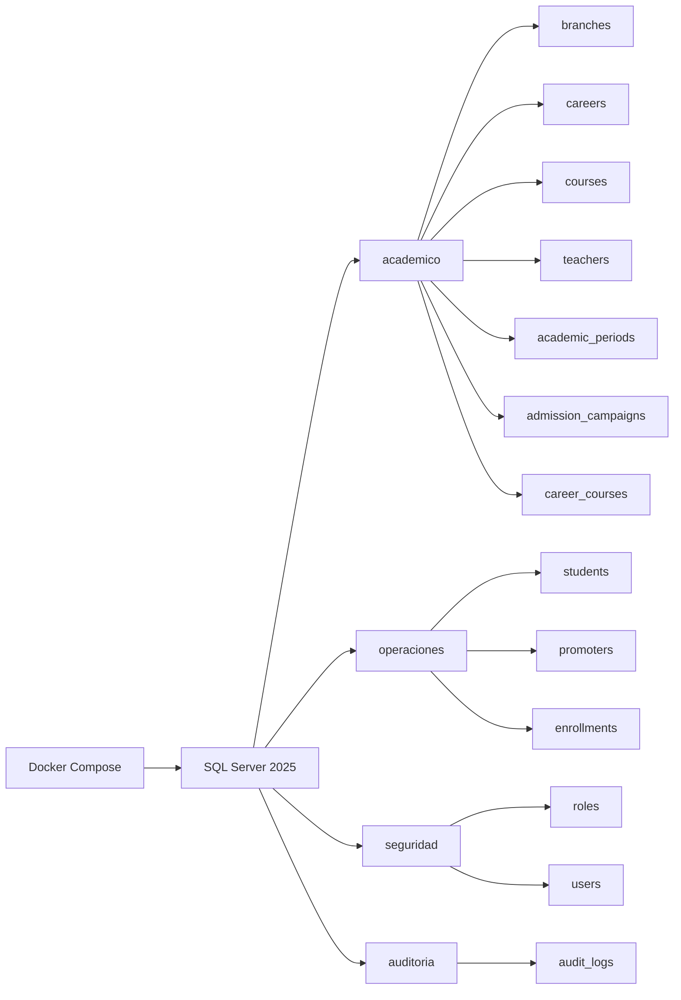

# MatriculaCloud360Enterprise


## 1. 📌 Descripción general del proyecto

**MatriculaCloud360Enterprise** es un sistema de gestión y matriculación académica de nivel enterprise, diseñado para ejecutarse sobre **SQL Server 2025** y desplegarse de forma completamente contenedorizada mediante **Docker** y **Docker Compose**.

El repositorio organiza la solución en scripts SQL de creación y carga de datos, con una arquitectura basada en **esquemas por dominio de negocio**:

- **seguridad** → roles y usuarios del sistema
- **academico** → sedes, carreras, cursos, docentes, periodos y campañas
- **operaciones** → estudiantes, promotores y matrículas
- **auditoria** → trazabilidad de operaciones críticas

Esta separación permite aislar claramente las responsabilidades de cada dominio, facilitar el mantenimiento y asegurar una mejor trazabilidad entre entidades, relaciones y procesos de matrícula.

El modelo incorpora llaves primarias con **IDENTITY**, llaves foráneas para integridad referencial, control de **borrado lógico** (`deleted_at`), y una **transacción** para el registro de matrículas que garantiza consistencia en operaciones críticas.



## 2. 🏗️ Arquitectura de la base de datos

La base de datos principal se crea con el nombre **`MatriculaCloud360`** y se organiza en los siguientes esquemas:

### academico

Contiene la información académica central del negocio:

| Tabla | Descripción |
|---|---|
| `branches` | Sedes o campus institucionales (`code`, `name`, `city`) |
| `careers` | Carreras académicas (`code`, `name`, `duration_cycles`, `total_investment`) |
| `teachers` | Docentes con especialidad y correo corporativo |
| `courses` | Cursos asociados a un docente (`teacher_id`) |
| `academic_periods` | Periodos académicos (`name`, `start_date`, `end_date`, `is_active`) |
| `admission_campaigns` | Campañas de admisión con porcentaje de comisión |
| `career_courses` | Relación muchos-a-muchos entre carreras y cursos |

### operaciones

Abarca los procesos transaccionales y operativos:

| Tabla | Descripción |
|---|---|
| `students` | Estudiantes registrados (`dni` único, `personal_email` único) |
| `promoters` | Promotores vinculados a un usuario del sistema y una sede base |
| `enrollments` | Matrículas académicas con vínculos a estudiante, carrera, sede, promotor, periodo y campaña |

La inserción de matrículas se maneja mediante una **transacción**, lo que permite confirmar todas las operaciones o revertirlas por completo ante cualquier error.

### seguridad

Centraliza los elementos de control de acceso:

| Tabla | Descripción |
|---|---|
| `roles` | Catálogo de roles del sistema (`Administrador`, `Coordinador Academico`, `Promotor`) |
| `users` | Usuarios del sistema con `username` único, `password_hash` y FK a `roles` |

### auditoria

Registra trazabilidad de eventos importantes:

| Tabla | Descripción |
|---|---|
| `audit_logs` | Bitácora de operaciones sobre tablas críticas, vinculada al usuario que ejecutó la acción |

### Criterios de diseño

- **IDENTITY** en todas las llaves primarias para auto-numeración consistente.
- **Llaves foráneas** para asegurar integridad referencial entre tablas.
- **Borrado lógico** con `deleted_at` en las tablas operativas y académicas principales.
- **Separación por dominio** (`academico`, `operaciones`, `seguridad`, `auditoria`) para mantener una arquitectura clara y escalable.
- **Registro de auditoría** para soportar seguimiento de operaciones críticas.
- **Campos únicos** (`dni`, `email`, `username`, `code`) para evitar duplicados a nivel de negocio.

## 3. 📁 Estructura del repositorio

```text
MatriculaCloud360Enterprise/
├── datasets/
├── docker/
├── sqlserver/
│   ├── ddl/
│   │   ├── 01_database.sql
│   │   ├── 02_schemas.sql
│   │   ├── 03_tables.sql
│   │   └── 04_constraints.sql
│   ├── dml/
│   │   ├── 01_seed_data.sql
│   │   └── 02_test_data.sql
│   └── programmability/
│       ├── functions/
│       │   └── fn_CalcularComision.sql
│       ├── procedures/
│       │   ├── usp_RegistrarEstudiante.sql
│       │   ├── usp_ActualizarEstudiante.sql
│       │   ├── usp_EliminarEstudiante.sql
│       │   ├── usp_ListarEstudiantes.sql
│       │   ├── usp_ObtenerMatricula.sql
│       │   └── usp_RegistrarMatricula.sql
│       └── views/
│           ├── vw_Matriculas.sql
│           └── vw_EstudiantesMatriculados.sql
├── docker/
│   ├── docker-compose.yml
│   ├── .env
│   ├── init/
│   │   ├── init.sql
│   │   └── wait-for-sql.sh
│   └── volumes/
└── README.md
```

### datasets/

Directorio destinado a material de apoyo, documentación complementaria o recursos de datos asociados al proyecto (incluye el diccionario de datos).

### docker/

Contiene la configuración del entorno contenedorizado:

- `docker-compose.yml`: define el servicio de SQL Server 2025, el puerto publicado y el volumen persistente.
- `.env`: variables de entorno del entorno local.
- `init/`: scripts auxiliares para inicialización automática (`init.sql`, `wait-for-sql.sh`).
- `volumes/`: carpeta preparada para la persistencia de datos del contenedor.

### sqlserver/

Incluye los scripts SQL que construyen y alimentan la base de datos:

- `ddl/01_database.sql`: creación de la base de datos `MatriculaCloud360`.
- `ddl/02_schemas.sql`: creación de los 4 esquemas por dominio.
- `ddl/03_tables.sql`: definición de todas las tablas con sus llaves y restricciones.
- `ddl/04_constraints.sql`: restricciones CHECK adicionales (montos, fechas, rangos).
- `dml/01_seed_data.sql`: inserción de datos iniciales y carga transaccional de matrículas.
- `dml/02_test_data.sql`: datos de prueba adicionales para validar operaciones.
- `programmability/functions/`: funciones escalares reutilizables (`fn_CalcularComision`).
- `programmability/procedures/`: procedimientos almacenados para CRUD y matrícula (`usp_*`).
- `programmability/views/`: vistas para consulta de información relevante (`vw_*`).

## 4. ⚙️ Prerrequisitos

Antes de ejecutar el proyecto, asegúrate de contar con lo siguiente:

- **Docker** instalado y en ejecución (Docker Desktop recomendado).
- **Docker Compose** disponible como parte de Docker Desktop o como comando independiente.
- Un cliente de administración SQL: **Azure Data Studio** o **SQL Server Management Studio (SSMS)**.

## 5. 🚀 Instalación y ejecución rápida

### Paso 1. Clonar o abrir el repositorio

Ubica una terminal en la raíz del proyecto `MatriculaCloud360Enterprise`.

### Paso 2. Definir la contraseña de SQL Server

El archivo `docker/docker-compose.yml` utiliza la variable de entorno `SA_PASSWORD`. La forma más simple es usar el archivo `docker/.env` que ya incluye el valor del entorno local.

Si prefieres definirla manualmente en PowerShell:

```powershell
$env:SA_PASSWORD = "Admin2026"
```

### Paso 3. Levantar el contenedor

Desde la carpeta `docker/`, ejecuta:

```bash
docker-compose up
```

Si prefieres hacerlo desde la raíz del repositorio:

```bash
docker compose --env-file docker/.env -f docker/docker-compose.yml up -d
```

Con la sintaxis clásica:

```bash
docker-compose --env-file docker/.env -f docker/docker-compose.yml up -d
```

### Paso 4. Verificar que el servicio esté activo

```bash
docker ps
```

Debes ver un contenedor llamado **`sqlserver_matricula`** publicando el puerto **1433**.

Si necesitas reiniciar la base desde cero, detén el entorno con:

```bash
docker compose --env-file docker/.env -f docker/docker-compose.yml down -v
```

### Paso 5. Conectarse a la base de datos

Usa Azure Data Studio o SSMS con los siguientes datos:

- **Servidor:** `localhost,1433`
- **Tipo de autenticación:** SQL Login
- **Usuario:** `sa`
- **Contraseña:** el valor definido en `SA_PASSWORD`

### Paso 6. Inicialización automática

Al levantarse el contenedor, Docker Compose ejecuta automáticamente la secuencia de inicialización:

1. **`01_database.sql`** — Creación de la base de datos `MatriculaCloud360`.
2. **`02_schemas.sql`** — Creación de los esquemas `academico`, `operaciones`, `seguridad` y `auditoria`.
3. **`03_tables.sql`** — Creación de tablas, llaves primarias, foráneas y restricciones.
4. **`04_constraints.sql`** — Restricciones CHECK (monto > 0, fechas coherentes, rangos, etc.).
5. **`01_seed_data.sql`** — Carga de datos iniciales (roles, usuarios, sedes, carreras, docentes, periodos, campañas, cursos, estudiantes, promotores y matrículas de ejemplo).
6. **`02_test_data.sql`** — Carga de datos de prueba (5 estudiantes adicionales, 1 periodo, 1 campaña, 5 matrículas).
7. **`fn_CalcularComision.sql`** — Creación de la función escalar para calcular comisiones.
8. **`usp_*.sql`** (6 procedimientos) — Creación de procedimientos almacenados (registrar, actualizar, eliminar, listar estudiantes, obtener y registrar matrícula).
9. **`vw_*.sql`** (2 vistas) — Creación de vistas de matriculas y estudiantes matriculados.

Si deseas ejecutar los scripts de forma manual para pruebas o mantenimiento, puedes usar este orden desde tu cliente SQL:

```text
sqlserver/ddl/01_database.sql
sqlserver/ddl/02_schemas.sql
sqlserver/ddl/03_tables.sql
sqlserver/dml/01_seed_data.sql
```

Al finalizar la inicialización automática, la base de datos `MatriculaCloud360` quedará lista con **13 tablas**, datos semilla, datos de prueba, y los objetos de programabilidad del Sprint 2.

## 6. 🧩 Objetos de programabilidad (Sprint 2)

### Procedimientos almacenados (`usp_*`)

| Procedimiento | Descripción |
|---|---|
| `usp_RegistrarEstudiante` | Registra un estudiante validando DNI y email únicos. Inserta auditoría. |
| `usp_ActualizarEstudiante` | Actualiza datos de un estudiante. Soporta soft-delete vía `@deleted_at`. |
| `usp_EliminarEstudiante` | Eliminación lógica (soft-delete) de un estudiante. |
| `usp_ListarEstudiantes` | Lista estudiantes con filtro opcional de eliminados (`@incluir_eliminados`). |
| `usp_ObtenerMatricula` | Obtiene detalle completo de una matrícula por ID o código. |
| `usp_RegistrarMatricula` | Registra una matrícula con validación cruzada y transacción. |

### Función escalar (`fn_*`)

| Función | Descripción |
|---|---|
| `fn_CalcularComision` | Calcula la comisión del promotor: `amount * (commission_percentage / 100)`. |

### Vistas (`vw_*`)

| Vista | Descripción |
|---|---|
| `vw_Matriculas` | Detalle completo de matrículas con estudiante, carrera, sede, promotor, periodo, campaña, monto y comisión. |
| `vw_EstudiantesMatriculados` | Estudiantes agrupados con cantidad de matrículas, monto total invertido y última fecha. |

### Transacciones y manejo de errores

El procedimiento `usp_RegistrarMatricula` utiliza `BEGIN TRANSACTION`, `COMMIT` y `ROLLBACK` con `TRY...CATCH`:

```sql
BEGIN TRY
    BEGIN TRANSACTION;
    -- INSERT en enrollments
    -- INSERT en audit_logs
    COMMIT TRANSACTION;
END TRY
BEGIN CATCH
    IF @@TRANCOUNT > 0
        ROLLBACK TRANSACTION;
    RAISERROR(...);
END CATCH
```

Todas las validaciones (promotor pertenece a la sede, periodo activo, campaña activa, monto > 0) se ejecutan **antes** de iniciar la transacción, minimizando el riesgo de rollbacks.

### Restricciones CHECK (`04_constraints.sql`)

| Restricción | Validación |
|---|---|
| `CK_enrollments_amount` | `amount > 0` |
| `CK_admission_campaigns_commission_percentage` | `commission_percentage BETWEEN 0 AND 100` |
| `CK_academic_periods_end_date` | `end_date > start_date` |
| `CK_enrollments_enrollment_date` | `enrollment_date <= GETDATE()` |
| `CK_courses_credits` | `credits BETWEEN 1 AND 30` |
| `CK_careers_duration_cycles` | `duration_cycles BETWEEN 1 AND 12` |
| `CK_careers_total_investment` | `total_investment > 0` |

## 6. 👤 Autor / Desarrollador

**Luis Mencia Chipa**

---

*Proyecto académico orientado a la implementación de una plataforma enterprise de gestión y matriculación sobre SQL Server 2025 con despliegue en contenedores.*